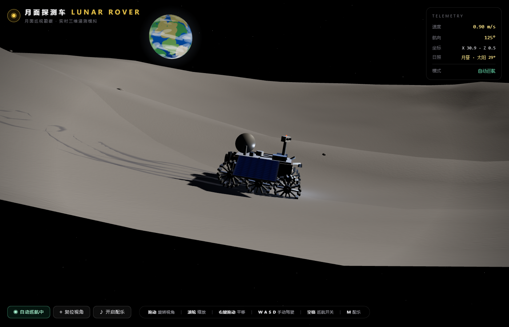

# 月面探测车 · LUNAR ROVER

一款让人放空心绪的月面漫步网页游戏。驾驶高精度 3D 探测车，在无限延伸的月球表面缓慢行驶——头顶是星空与缓缓自转的地球，身后留下六道车辙，十分钟经历一次月昼与月夜。

**▶ 在线游玩：<https://daka-agent.github.io/mooncar/>**

## 操作

- 拖动鼠标：旋转视角 ｜ 滚轮：缩放 ｜ 右键拖动：平移
- `W A S D`：手动驾驶 ｜ `空格`：自动巡航 ｜ `M`：空灵配乐开关

## 说明

本仓库仅存放自动构建产物（由私有源码仓库的 GitHub Actions 自动发布，请勿直接提交）。
技术栈：React · TypeScript · Three.js · Web Audio API——模型、地形、纹理、音乐全部程序化生成，零外部资源。
